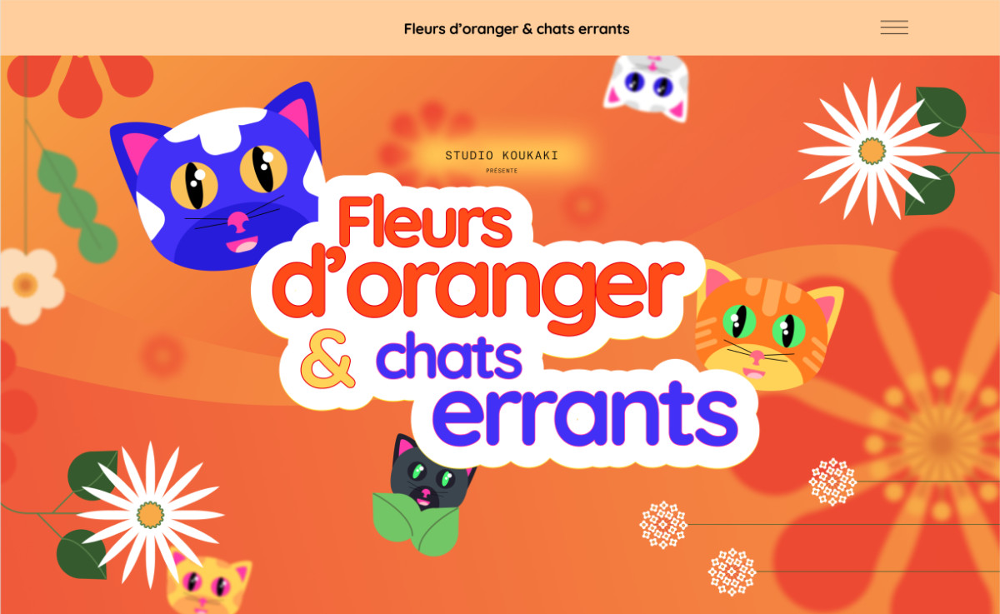

# Koukaki Animation Studio

**Optimisation du site d'un studio d'animation avec JavaScript et animations CSS**

## 🚸 Objectif du Projet

L'objectif de ce projet est de moderniser et dynamiser le site web du studio d’animation Koukaki, célèbre pour son récent film nominé aux Oscars dans la catégorie meilleur court-métrage d’animation.

## 💻 Étapes du Projet

- Installation de WordPress
- Configuration d'une sauvegarde système
- Analyse approfondie du code existant
- Activation du thème enfant et intégration des fichiers essentiels :

  - footer.php
  - front-page.php
  - functions.php
  - header.php

- 📂 Création du répertoire "assets" comprenant :

  - css : intégration du style du thème
  - fonts : ajout des polices Google (éventuellement, les charger localement)
  - images : gestion des nouvelles images et mise à jour des liens
  - js : ajout des scripts JavaScript nécessaires
  - video : intégration de la vidéo d'intro (à confirmer)

- Implémentation des fonctionnalités suivantes :

  - Intégration de la vidéo dans la section d'introduction
  - Effet d'apparition pour la vidéo et le logo titre
  - Animation progressive des sections
  - Animation du logo titre au défilement
  - Rotation des fleurs sur la page (à l'exception de celles intégrées dans l'image de fond)
  - Adaptation du fond de la section "le lieu" avec ajout de nuages flous
  - Effet interactif sur les titres h2 au survol des sections
  - Création de la nouvelle section "Oscar"

- Intégration des modifications dans le thème enfant

- Révision des animations pour une gestion optimisée en CSS

- Utilisation de l'IntersectionObserver pour activer les animations de fade-in lors de l'affichage des sections

- Accélération de la rotation des fleurs en fonction du défilement

- Positionnement des fleurs dans le footer, à côté de la section Oscar

- Ajout d'un effet de tremblement sur le logo titre une fois positionné

- Mise en place du mouvement vertical des nuages en fonction du défilement

- Création d'un template avec un slider SWIPER pour afficher les personnages

- Animation des titres h2 et h3 au défilement en utilisant IntersectionObserver

- ⚙ Refonte de la navigation :

  - Remplacement du menu par un bouton hamburger ouvrant une page en plein écran
  - Intégration d'une page modale pour afficher le nouveau menu, avec décorations animées (chats flottants et fleurs tournantes)

- Optimisation responsive avec l'utilisation de media queries

- Intégration de jQuery pour gérer l'affichage de la modal pour le menu

- Ajustement de l'affichage des titres h3 et du logo titre en version mobile

- Adaptation du fond de la section des nominations

- Encapsulation du code jQuery dans une fonction pour une meilleure gestion

- Création des pages contact et RGPD

## Réalisation

Découvrir le projet en ligne 🔗 [Koukaki Studio](https://studio-koukaki.assoumani.pro/)

<em>Projet 9 - Améliorez le site d'un studio d'animation avec JavaScript et des animations CSS - Openclassrooms 2024</em>

